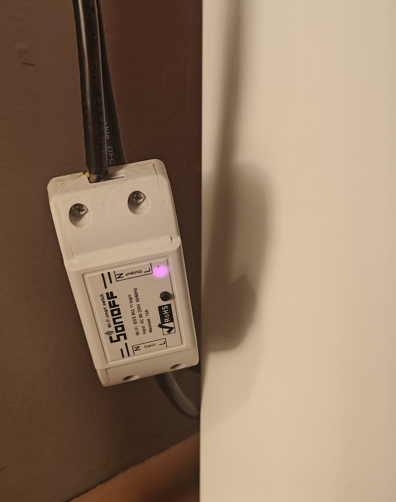

# SoundWatcher

Audio activity monitoring tool for Windows (WASAPI/ASIO) with HTTP notification support and Home Assistant MQTT integration.

## Features

- ✅ Monitor **WASAPI** devices (Windows Audio Session API) - standard Windows audio devices
- ✅ Monitor **ASIO** devices - professional low-latency audio interfaces
  - ASIO devices can be detected through **input monitoring** - the application uses silent capture to activate audio metering
- ✅ Monitor **multiple devices simultaneously**
- ✅ Send HTTP requests when audio starts (ON) and stops (OFF)
- ✅ Configurable delay before sending OFF signal
- ✅ Real-time **peak level monitoring** for LED control
  - Peak values are smoothed by sampling every 10ms and sending averaged values
- ✅ **Home Assistant MQTT Discovery** integration
  - Binary sensor with device class "sound"
  - Automatic discovery - no manual configuration needed
- ✅ System tray icon with context menu
- ✅ Pause/resume monitoring
- ✅ Modern settings interface with tabs
- ✅ Configurable **audio detection threshold** to filter background noise

## Use Case

I use SoundWatcher to automatically power on my Yamaha HS-80 studio monitors only when needed:


This works by sending HTTP requests to a Sonoff switch running Tasmota firmware:



As a bonus, an LED strip controlled by Tasmota pulses to the music:


## Requirements

### Runtime
- Windows 10 or newer
- .NET 8 Runtime (Desktop) - https://dotnet.microsoft.com/download/dotnet/8.0

### Building
One of the following:
1. **.NET 8 SDK** - https://dotnet.microsoft.com/download/dotnet/8.0 (Recommended)
2. **Build Tools for Visual Studio 2022** with ".NET desktop build tools" component

**Don't have .NET 8 SDK?** Run `download-sdk.bat` - it will open the download page.

Full installation instructions: [INSTALL_SDK.md](INSTALL_SDK.md)

## Building

### Quick Start (Recommended)
```bash
build.bat
```
The script will automatically detect available build tools (.NET SDK or MSBuild).

### Single-File EXE (Recommended for Distribution)

Create a single EXE file with all libraries:

```bash
publish-single-file.bat
```

Output: `bin\Release\net8.0-windows\win-x64\publish\SoundWatcher.exe`

- **Size**: ~550 KB
- **Requires**: .NET 8 Runtime installed on the system

### Standalone EXE (Fully Self-Contained)

Create an EXE file with embedded .NET runtime (works without .NET installation):

```bash
publish-standalone.bat
```

- **Size**: ~70-80 MB
- **Requires**: Nothing - works immediately

### Alternative Methods

**Using .NET SDK directly:**
```bash
dotnet build -c Release
```

**Single-file publish manually:**
```bash
dotnet publish -c Release -r win-x64 --self-contained false -p:PublishSingleFile=true
```

**Manually using MSBuild (requires VS 2022 Build Tools):**
```bash
msbuild SoundWatcher.csproj /p:Configuration=Release /restore
```

## Installation

### After Standard Build (build.bat)
Executable is located at:
```
bin\Release\net8.0-windows\SoundWatcher.exe
```
Copy the entire `net8.0-windows` directory to your desired location.

### After Publish (single-file)
Executable is located at:
```
bin\Release\net8.0-windows\win-x64\publish\SoundWatcher.exe
```
Copy only the `SoundWatcher.exe` file to your desired location - no other files needed.

## Usage

1. Run `SoundWatcher.exe`
2. Icon will appear in the system tray
3. Right-click the icon → **Settings**
4. Configure:
   - **Audio Devices**: Check the devices you want to monitor
   - **HTTP Notifications**: Enter URLs for ON/OFF notifications
   - **Timing Settings**: Set check interval and OFF delay
   - **Home Assistant**: Configure MQTT connection (optional)
5. Click **Save**

### Running with Logs (Debugging)

To see real-time logs:

```bash
cd "d:\dev\soundwatcher"
dotnet run
```

Or run the compiled exe from terminal:

```bash
cd "d:\dev\soundwatcher\bin\Debug\net8.0-windows"
.\SoundWatcher.exe
```

Logs are also saved to:
```
%APPDATA%\SoundWatcher\soundwatcher.log
```

### System Tray Context Menu
- **Turn ON** - Manually send ON notifications
- **Turn OFF** - Manually send OFF notifications
- **Pause Monitoring** - Pause/resume monitoring (icon shows white pause overlay when paused)
- **Settings** - Open settings window
- **Exit** - Close application

## Configuration

Settings are saved to:
```
%APPDATA%\SoundWatcher\settings.json
```

### Example Configuration
```json
{
  "OnUrls": [
    "http://192.168.1.10/cm?cmnd=Power%20ON",
    "http://192.168.1.20/webhook/audio-started"
  ],
  "OffUrls": [
    "http://192.168.1.10/cm?cmnd=Power%20OFF",
    "http://192.168.1.20/webhook/audio-stopped"
  ],
  "OnUrlsEnabled": true,
  "OffUrlsEnabled": true,
  "VolumeUrl": "http://192.168.1.30/?m=1&d0={VOL}",
  "VolumeUrlEnabled": true,
  "VolumeUpdateIntervalMs": 120,
  "CheckIntervalMs": 1000,
  "TurnOffDelayMs": 30000,
  "AudioThreshold": 2.0,
  "MonitoredDeviceIds": [
    "{0.0.0.00000000}.{device-guid}"
  ],
  "MonitoringEnabled": true,
  "MqttEnabled": true,
  "MqttBroker": "192.168.1.100",
  "MqttPort": 1883,
  "MqttUsername": "",
  "MqttPassword": "",
  "MqttDeviceName": "PC Audio Monitor"
}
```

### Peak Level URL for LED Control

The `VolumeUrl` supports a `{VOL}` placeholder which is replaced with the current peak level (0-100):

```
http://192.168.1.219/?m=1&d0={VOL}
```

This is useful for controlling LED strips or other devices that respond to audio levels.

## Performance Optimizations

The application dynamically adjusts its checking interval to minimize CPU usage:

- **Audio OFF**: Checks every 1000ms (check interval)
- **Audio ON without peak monitoring**: Checks every 1000ms (check interval)
- **Audio ON with peak monitoring**: Checks every 120ms (peak update interval)

MQTT state changes are only sent when the state actually changes, not on every check.

## Differences from Old Version

### Removed
- ❌ Dependency on CSCore.dll
- ❌ Dependency on bass.dll
- ❌ Requirement for Visual Studio to build
- ❌ .NET Framework 4.5.2

### Added
- ✅ Direct P/Invoke for WASAPI (no external DLLs for WDM)
- ✅ Input device monitoring via silent capture (enables IAudioMeterInformation)
- ✅ ASIO support (via NAudio.Asio)
- ✅ Multi-device selection
- ✅ .NET 8 (modern, faster, better support)
- ✅ Tabbed settings interface
- ✅ URL testing from settings
- ✅ Better OFF delay management (cancels when audio detected again)
- ✅ Peak smoothing for LED control
- ✅ Configurable audio detection threshold
- ✅ Home Assistant MQTT Discovery integration
- ✅ Enable/disable individual URL groups (ON, OFF, Peak)

## Architecture

```
.
├── Audio/
│   ├── WasapiInterop.cs      # P/Invoke for Windows Core Audio API
│   ├── WasapiMonitor.cs      # WASAPI device monitor
│   ├── AsioMonitor.cs        # ASIO device monitor (NAudio)
│   └── AudioMonitor.cs       # Unified monitor (WASAPI + ASIO)
├── Configuration/
│   └── AppSettings.cs        # Configuration management (JSON)
├── Network/
│   └── HttpNotifier.cs       # HTTP notification sender
├── HomeAssistant/
│   └── HomeAssistantMqtt.cs  # MQTT Discovery integration
├── Logging/
│   └── Logger.cs             # Dual console+file logging
├── UI/
│   └── SettingsForm.cs       # Settings interface
├── Program.cs                # Entry point + system tray
└── Resources/
    └── AppIcon.ico           # Application icon
```

## Troubleshooting

### Application doesn't detect ASIO devices
- Make sure ASIO drivers are installed
- Some ASIO drivers require administrator privileges
- ASIO devices can be detected via input monitoring

### HTTP requests are not sent
- Check URLs in "HTTP Notifications" tab
- Use "Test ON URLs" / "Test OFF URLs" buttons
- Check firewall/antivirus settings

### High CPU usage
- Increase "Check interval" in timing settings (e.g., to 2000ms)
- Disable peak monitoring if not needed

### Input devices don't show audio activity
- The application uses silent capture to activate metering
- This works for most devices, but some drivers may not support it

## License

This project uses:
- **MQTTnet** (MIT License) - https://github.com/dotnet/MQTTnet
- **NAudio.Asio** (MIT License) - https://github.com/naudio/NAudio

## Author

AIAC

Rebuilt from .NET Framework 4.5.2 to .NET 8
